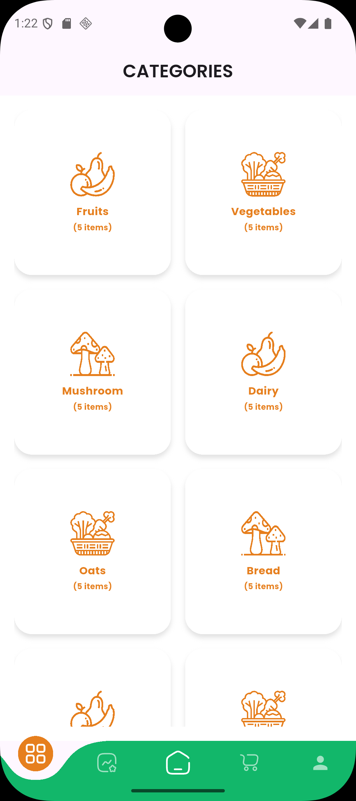
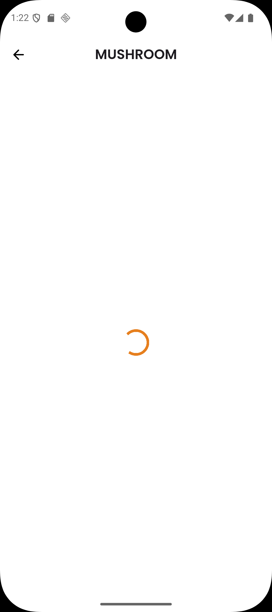
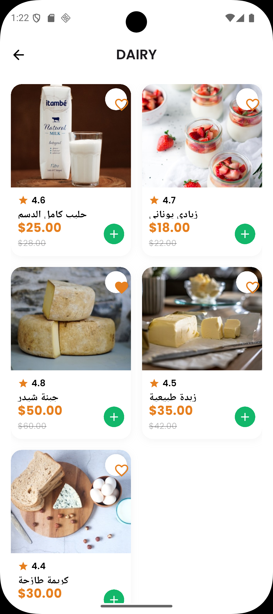
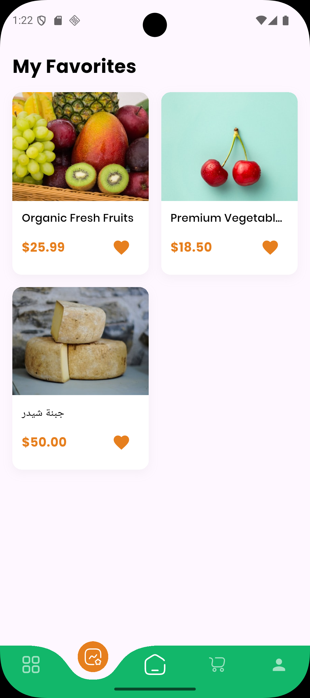
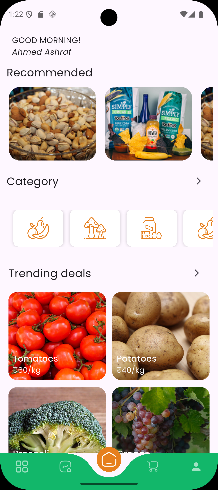
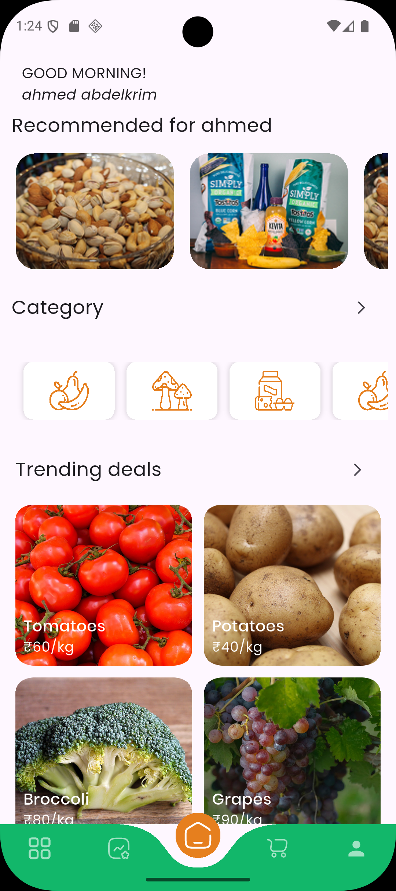
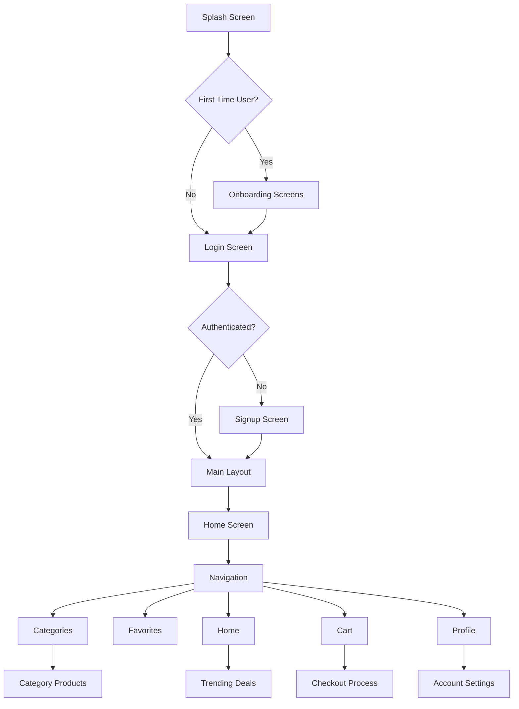

# Grocery App

A modern, feature-rich grocery shopping application built with Flutter. This app provides a seamless shopping experience with Firebase integration for authentication and data management.

## 📱 Screenshots

<p align="center">
  
  
  
  
</p>

<p align="center">
  
  
  
  
</p>

## 🌟 Features

- **User Authentication**: Secure sign up and login with Firebase Authentication
- **Product Browsing**: Explore products by categories
- **Shopping Cart**: Add, remove, and manage items in your cart
- **Favorites**: Save your favorite products for quick access
- **User Profile**: Manage personal information and account settings
- **Trending Deals**: Discover special offers and promotions
- **Responsive Design**: Works seamlessly on mobile, tablet, and desktop

## 🛠️ Technologies & Packages

### Core Technologies
- **Flutter**: Cross-platform mobile development framework
- **Dart**: Programming language for Flutter
- **Firebase**: Backend-as-a-Service for authentication and data storage

### Key Packages
- **go_router**: Advanced routing and navigation
- **flutter_bloc**: State management using the BLoC pattern
- **dio**: HTTP client for API requests
- **firebase_core**: Core Firebase integration
- **firebase_auth**: Firebase Authentication
- **cloud_firestore**: Cloud Firestore database
- **cached_network_image**: Efficient image loading and caching
- **curved_navigation_bar**: Beautiful curved navigation bar
- **shimmer**: Loading skeleton animations
- **json_annotation**: JSON serialization support

## 🏗️ Architecture

The app follows a modular architecture with clear separation of concerns:

```
lib/
├── constants/              # App-wide constants and assets
├── core/                   # Shared logic and utilities
│   ├── api/                # HTTP requests and API services
│   ├── constants/          # App constants
│   ├── errors/             # Custom exceptions and failures
│   ├── helper_function/    # Utility functions
│   ├── navigation/         # App routing configuration
│   ├── services/           # Firebase and shared services
│   ├── theme/              # App styling and themes
│   └── widgets/            # Reusable UI components
└── features/               # Feature-based modules
    ├── auth/               # Authentication flow
    ├── cart/               # Shopping cart functionality
    ├── categories/         # Product categorization
    ├── favorites/          # Favorite items management
    ├── home/               # Main dashboard
    ├── layout/             # Main app layout
    ├── onboarding/         # User onboarding experience
    ├── profile/            # User profile management
    ├── splash/             # Splash screen
    └── trending_deals/     # Promotional deals section
```

## 🔄 App Flow



## 🎨 UI/UX Design

### Color Palette
- **Primary Orange**: `#E67F1E` - Used for accents and call-to-action buttons
- **Primary Green**: `#12B76A` - Used for success states and confirmations
- **White**: `#FFFFFF` - Background and clean elements
- **Black**: `#000000` - Primary text color

### Typography
- **Poppins**: Main font family with weights 400, 500, 600, 700
- **Jost**: Secondary font for headings
- **Inter**: Bold text elements

## 🚀 Getting Started

### Prerequisites
- Flutter SDK (3.8.0 or higher)
- Dart SDK
- Android Studio or VS Code
- Firebase account

### Installation

1. Clone the repository:
   ```bash
   git clone https://github.com/your-username/grocery_app.git
   ```

2. Navigate to the project directory:
   ```bash
   cd grocery_app
   ```

3. Install dependencies:
   ```bash
   flutter pub get
   ```

4. Set up Firebase:
   - Create a Firebase project at [Firebase Console](https://console.firebase.google.com/)
   - Add your Android/iOS app to the Firebase project
   - Download `google-services.json` (Android) and `GoogleService-Info.plist` (iOS)
   - Place these files in their respective directories

5. Run the app:
   ```bash
   flutter run
   ```

## 📁 Project Structure

The app follows a feature-first architecture where each major functionality is organized in its own directory under `lib/features/`:

```
features/
├── auth/                 # Authentication system
│   ├── data/             # Models and repositories
│   ├── domain/           # Business logic
│   └── presentation/     # UI components and state management
├── cart/                 # Shopping cart functionality
├── categories/           # Product categories
├── favorites/            # Favorite items
├── home/                 # Main dashboard
├── layout/               # Main app layout with navigation
├── onboarding/           # First-time user experience
├── profile/              # User profile management
├── splash/               # Initial loading screen
└── trending_deals/       # Special offers section
```

## 🔐 Firebase Integration

The app uses Firebase for:
- **Authentication**: Email/password sign up and login
- **Firestore**: Storing user data and product information
- **Real-time Updates**: Instant synchronization of cart and favorites

## 📱 Responsive Design

The app is designed to work on multiple platforms:
- **Mobile**: Primary target platform
- **Tablet**: Optimized layouts for larger screens
- **Desktop**: Experimental support for desktop platforms
- **Web**: Browser-based version

## 🧪 Testing

The app includes:
- Unit tests for business logic
- Widget tests for UI components
- Integration tests for critical user flows

To run tests:
```bash
flutter test
```

## 🤝 Contributing

1. Fork the repository
2. Create a feature branch (`git checkout -b feature/AmazingFeature`)
3. Commit your changes (`git commit -m 'Add some AmazingFeature'`)
4. Push to the branch (`git push origin feature/AmazingFeature`)
5. Open a pull request

## 📄 License

This project is licensed under the MIT License - see the [LICENSE](LICENSE) file for details.

## 🙏 Acknowledgements

- [Flutter](https://flutter.dev/)
- [Firebase](https://firebase.google.com/)
- [Material Design](https://material.io/)